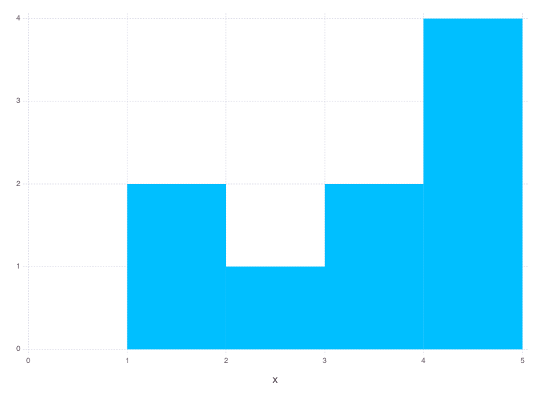
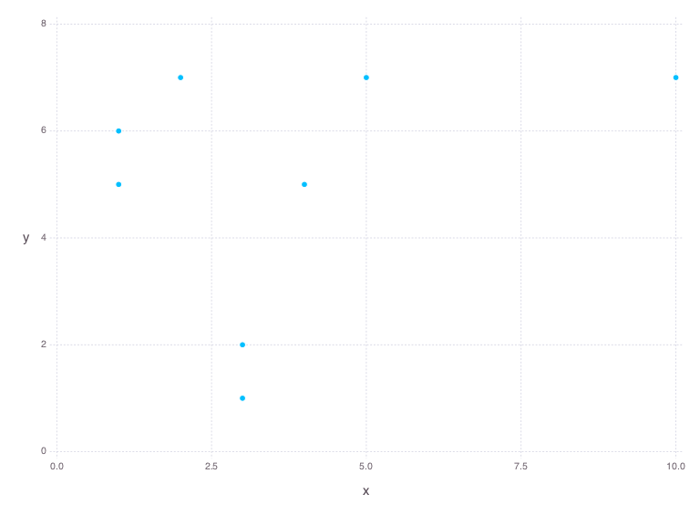
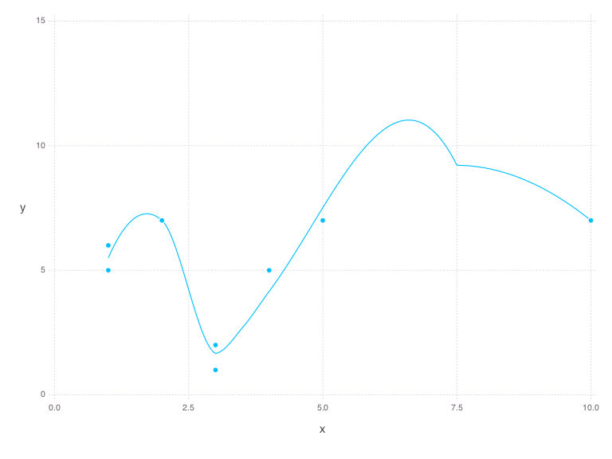
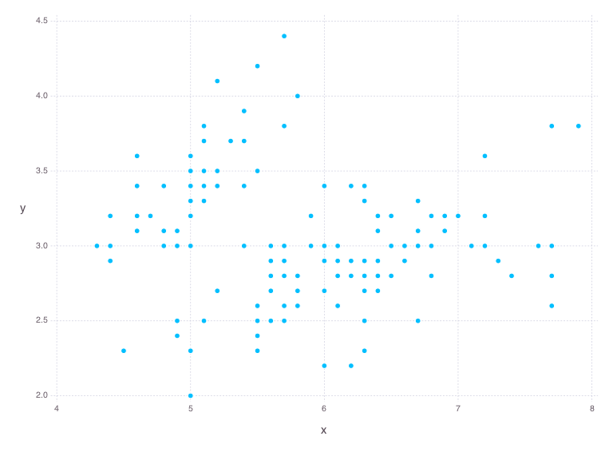

# Plot.jl: A command-line interface in Julia to practical data visualization
<span style="float:right">v.0.1.0</span>
[](https://gitter.im/dmoliveira/My-Data-Science-Toolbox?utm_source=badge&utm_medium=badge&utm_campaign=pr-badge&utm_content=badge)
## 1. Introduction
`Plot.jl` is a practical solution to plot simple and beautiful graphs at command-line. It was built entirely on [Julia language](http://julialang.org/) and uses [Gadfly](http://dcjones.github.io/Gadfly.jl/) package. I suggest to use with others powerful tools like `CSVKit` and `jq` as an input source to generate the graphs on-the-fly.

## 2. Julia Packages Dependencies
```
Pkg.add("Gadfly")
Pkg.add("Cairo")
```

## 3. Syntax Usage
```
plot.jl plot_type x [, y, outputfile]
```

* `plot_type`: Can be `Hist`, `Scatter` or `Smooth`.
* `x`: Number list separated by space only.
* `y`: Used only in `Scatter` and `Smooth` plot_type. Number list separated by space only.
* `output`: Optional output filename.

## 4. Examples
### 4.1. Plot a histogram
```
plot.jl Hist "1 4 5 3 3 5 1 2 5"
```


### 4.2. Plot a scatter plot
```
plot.jl Scatter "1 4 4 3 3 3 1 2 5 10" "5 5 5 1 2 2 6 7 7 7"
```


### 4.3. Plot a smooth curve
```
plot.jl Smooth "1 4 4 3 3 3 1 2 5 10" "5 5 5 1 2 2 6 7 7 7"
```


### 4.4. Use files as input source
```
./plot.jl Scatter "$(cat ./sample/iris-data-x.txt | tr '\n' ' ')" "$(cat ./sample/iris-data-y.txt | tr '\n' ' ')"
```


* Improvement and new ways of reading input sources may be added in the future.

### 4.5. A more complex usage case
In this example we'll show how combining this simple library with other unix tools can be powerful and achieve practical results in few minutes instead of a hour of making a script code.


First we'll get currency data from different countries using a REST API. Second we'll process this data and get only the related data of EUR x USD. At last we'll plot this data over August month using  smooth curve on `plot.jl`.

```
# 1. Get JSON data from September August
json=`parallel -j1  "curl -s -XGET http://api.fixer.io/2015-08-{1}" :::: <( seq -f %02g 1 31)`

# 2. Process Data: Get USD currency
currency=`echo $json | jq '.[].USD|select(length > 0)' | tr '\n' ' '`

# 3. Lets plot Smooth Curve
plot.jl Smooth "$currency" "$(seq -s ' ' 1 31)"
```


## 5. Contributions
Please send pull-requests or open issues on GitHub. Use Gitter to chat about this project. All are welcome.
